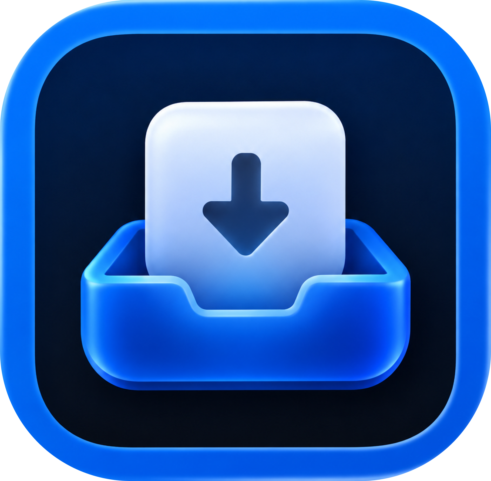

<p align="center"></p>

# Dropzone

A free, native macOS file shelf. Collect files, switch apps, and drag them out when you need them. No accounts, cloud uploads, analytics, or artificial delays.

https://github.com/user-attachments/assets/d1c0c1c1-cd83-49cb-83d6-b6b0d28dbbbf

## Quick Start

### Homebrew · Apple Silicon

```sh
brew tap demureiskander/dropzone https://github.com/demureiskander/dropzone.git
brew trust --cask demureiskander/dropzone/demureiskander-dropzone
brew install --cask demureiskander/dropzone/demureiskander-dropzone
open -a Dropzone
```

The `trust` line is for Homebrew 6 and newer; skip it on older versions. The tap lives in this repository. The distinct cask name avoids confusion with Aptonic's commercial Dropzone.

### Direct download

Download the [DMG](https://github.com/demureiskander/dropzone/releases/download/v0.1.7/Dropzone-0.1.7-macOS-arm64.dmg) or [ZIP](https://github.com/demureiskander/dropzone/releases/download/v0.1.7/Dropzone-0.1.7-macOS-arm64.zip), then move **Dropzone.app** into **Applications**. [Checksums](https://github.com/demureiskander/dropzone/releases/download/v0.1.7/SHA256SUMS.txt) are attached to the [release](https://github.com/demureiskander/dropzone/releases/tag/v0.1.7).

Requires Apple Silicon and macOS 13+. This alpha is ad-hoc signed and not notarized: if macOS blocks first launch, review it in **System Settings → Privacy & Security**. The installer does not change security settings.

Launch Dropzone, pick up a file, shake the pointer, and drop the file onto the shelf. Open settings with **⌘,** while Dropzone has focus.

**Status: 0.1.7 alpha.** Native Swift + AppKit + SwiftUI application. A first-run onboarding explains the basic workflow. English is used by default; Russian is selected initially when macOS prefers Russian and remains available in Settings → General → Language. Changes apply immediately and persist between launches. Tested locally on Apple Silicon with macOS 26.5.2 and Xcode 26.6. Deployment target is macOS 13; older systems and Intel hardware have not yet been validated.

## Build and run

Requires Xcode 16 or newer with the command line tools selected. No third-party Swift package dependencies.

```sh
swift test
scripts/build.sh release
open build/Dropzone.app
```

Open `Package.swift` in Xcode to browse, build, and debug the targets. The build script wraps the executable in a normal `.app` bundle and applies an ad-hoc signature for local development. Run the bundle for menu bar behavior and Launch at Login. Distribution builds are not yet Developer ID signed or notarized.

## Use

Dropzone appears in both the menu bar and Dock by default. Change either independently in **Settings → General**. Changes apply immediately and persist. If both icons are hidden, reopen Dropzone from Applications to reach Settings.

- Click the menu bar tray icon, press **⌥⇧Space**, or shake while dragging files from Finder.
- On a MacBook with a camera notch, drag towards it for a glow; an outline marks the active drop zone.
- Drop files or folders onto the shelf or menu bar icon. Add files from different locations.
- Drag the compact stack to copy everything. Expand the shelf for grid/list views and select individual files; Shift-click selects the range from the anchor file; Command-click toggles only the clicked file.
- **Space:** Quick Look. **⌘A:** select all. **Delete:** remove shelf references. **⌘F:** toggle follow. **⌘W:** close and clear shelf. **Escape:** hide shelf. **⌘,** opens Settings while Dropzone has keyboard focus, using the physical comma key in any layout.
- Double-click a file to reveal it in Finder. The **…** menu provides file actions and settings. Right-click the menu bar icon for Quit and Settings.

Follow mode is enabled by default. The shelf moves alongside the pointer, changes sides with inertia, slows as you approach, and pauses while you interact. Its toggle persists between launches. Both compact and expanded views follow the pointer. File selection remains reachable because proximity and active interactions pause movement.

## File handling

Adding a Finder file stores a reference to the original. Dragging out supports **copy only**. A successful drop removes the transferred references from the shelf; cancelling or rejecting the drag keeps them. Clearing the shelf does not delete the originals. Closing with **×** or **⌘W** clears the shelf. By default, closing more than five items asks for confirmation; the toggle and threshold (1–1000) are in Settings → Shelf Behavior. Cancel keeps the shelf intact. Escape and the tray toggle preserve the shelf for this session; quitting discards the temporary list. Renamed files are resolved through bookmarks; missing files are marked unavailable when refreshed. Images and videos can show thumbnails; documents retain their system file icons.

This alpha accepts file URLs. Browser image exports, Photos file promises, text/URL snippets, automatic screenshot capture, multiple shelves, and cloud services are not included yet. Some source applications provide files differently and may not be compatible. See [validation](docs/VALIDATION.md) for what has actually been tested.

## Support

[Donate via Tribute](https://web.tribute.tg/d/GLT) · [GitHub repository](https://github.com/demureiskander/dropzone)

## Development

- [Project instructions](CLAUDE.md)
- [Research and sources](docs/RESEARCH.md)
- [MVP scope](docs/MVP.md)
- [Design and behavior](docs/DESIGN.md)
- [Architecture](docs/TECHNICAL_PLAN.md)
- [Validation and remaining checks](docs/VALIDATION.md)
- [Changelog](CHANGELOG.md)
- [Icon provenance and prompt](Resources/ASSET_PROVENANCE.md)

Run `scripts/package.sh` to produce DMG, ZIP and SHA256SUMS.txt in `build/releases`. The cask is in `Casks/demureiskander-dropzone.rb`; update its version and DMG checksum when publishing a new release. Packaging includes LICENSE and NOTICE in the app bundle.

The core motion and file-reference logic is isolated in `Sources/DropzoneCore`; the app lives in `Sources/Dropzone`. Run `swift test` for behavioral tests, `scripts/build.sh release` to create the application, and `scripts/icon.sh` to regenerate the ICNS from the included PNG. A [CI template](docs/ci/build.yml.example) builds and tests on macOS and uploads a development build. It is not enabled: the available GitHub token lacks the `workflow` scope. To enable it with suitable credentials, copy it to `.github/workflows/build.yml`.

Only [demureiskander/dropzone](https://github.com/demureiskander/dropzone) is authorized for this project's GitHub work. Private local visual references under `design/references/` are excluded from Git and the app bundle.

## License and name

[Apache License 2.0](LICENSE). Dropzone is the author's working name. A separate [Dropzone product by Aptonic](https://aptonic.com/releasenotes) already exists; this project is independent of Aptonic and Dropover. A distinct public product name remains a release-planning decision.
